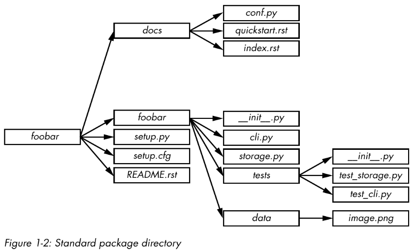

# Python Tips

## Table of Contents

- [Python Tips](#python-tips)
  - [Table of Contents](#table-of-contents)
  - [General Project Guidance](#general-project-guidance)
    - [Project Layout](#project-layout)
    - [Versioning](#versioning)
      - [PEP 440 / PyPA Guidelines](#pep-440--pypa-guidelines)
      - [Semantic Versioning](#semantic-versioning)
    - [Linting and Formating](#linting-and-formating)
      - [Ruff](#ruff)
        - [Configuration](#configuration)
      - [PyRight](#pyright)
  - [Modules, Libraries and Frameworks](#modules-libraries-and-frameworks)
    - [Importing](#importing)
    - [`sys` Module](#sys-module)
    - [Import Paths](#import-paths)
    - [Useful Standard Libraries](#useful-standard-libraries)
  - [Documentation](#documentation)
    - [Documenting API Changes](#documenting-api-changes)
    - [Diátaxis](#diátaxis)
    - [Generating Documentation from Docstrings](#generating-documentation-from-docstrings)
    - [Doctesting](#doctesting)
  - [Release Engineering](#release-engineering)
    - [Poetry](#poetry)
    - [Tox](#tox)
  - [The Abstract Syntax Tree](#the-abstract-syntax-tree)
  - [Bibliography](#bibliography)

## General Project Guidance

### Project Layout



Avoid storing unit tests outside the package directory. These tests should be included in a subpackage of your software so that they aren’t automatically installed as a `tests` top-level module by setuptools (or some  other packaging library) by accident. By placing them in a subpackage, you ensure they can be installed and eventually used by other packages so users can build their own unit tests.

Note that using `setup.py` is highly unadvised as it introduces arbitrary code into the build process. Also, executing the `setup.py` directly is [deprecated](https://blog.ganssle.io/articles/2021/10/setup-py-deprecated.html).

Some optional folders can also appear:

- `etc` for sample configuration files
- `tools` for shell scripts or related tools
- `bin` for binary scripts you’ve written that will be installed by setup.py

Organize the code based on features, not on file types. Don't create `functions.py` or `exceptions.py` files, but rather `api.py` or `time_travel.py` files.

Don't create a module folder which only contains an `__init__.py` file. If you create a module folder, it should contain several files that belong to it's category.

Be careful about the code that you put in the `__init__.py` file. This file will be called and executed the first time that a module contained in the directory is loaded. Placing the wrong things in your `__init__.py` can have unwanted side effects. In fact, `__init__.py` files should be empty most of the time. Don’t try to remove `__init__.py` files altogether though, or you won’t be able to import your Python module at all: Python requires an `__init__.py` file to be present for the directory to be considered a submodule.

### Versioning

Two main ways to version Python software:

#### PEP 440 / PyPA Guidelines

It must obey the following regex: `N[.N]+[{a|b|c|rc}N][.postN][.devN]`

This means versions such as `1.2.0` and `0.4.7` are allowed. Also:

- Version `1.3.0` is quivalent to `1.3`
- Versions matching `N[.N]+` (no suffix) are considered final releases.
- `N[.N]+aN` (e.g., `1.2a1`) denotes an alpha release, i.e., a version that might be unstable and missing features.
- `N[.N]+bN` (e.g., `1.2b1`) denotes a beta release, i.e., a version that might be feature complete but still buggy.
- `N[.N]+rcN` (e.g., `0.4rc1`) denotes a release candidate, i.e., a version that might be released as the final product unless significant bugs emerge.
- The suffix `.postN` (e.g., `1.4.post2`) indicates a post release. Post releases are typically used to address minor errors in the publication process, such as mistakes in release notes. You shouldn’t use the .postN suffix when releasing a bug-fix version, instead, increment the minor version number.
- The suffix `.devN` (e.g., `2.3.4.dev3`) indicates a developmental release. It indicates a prerelease of the version that it qualifies: e.g., 2.3.4.dev3 indicates the third developmental version of the 2.3.4 release, prior to any alpha, beta, candidate, or final release. This suffix is discouraged because it is harder for humans to parse.

More details [here](https://packaging.python.org/en/latest/specifications/version-specifiers/).

#### Semantic Versioning

Given a version number `MAJOR.MINOR.PATCH` (`X.Y.Z`), increment the:

- `MAJOR` version when you make incompatible API changes
- `MINOR` version when you add functionality in a backward compatible manner
- `PATCH` version when you make backward compatible bug fixes

Software using Semantic Versioning MUST declare a public API. This API could be declared in the code itself or exist strictly in documentation. However it is done, it SHOULD be precise and comprehensive.

A normal version number MUST take the form X.Y.Z where X, Y, and Z are non-negative integers, and MUST NOT contain leading zeroes. X is the major version, Y is the minor version, and Z is the patch version. Each element MUST increase numerically. For instance: `1.9.0` -> `1.10.0` -> `1.11.0`.

Once a versioned package has been released, the contents of that version MUST NOT be modified. Any modifications MUST be released as a new version.

Major version zero (`0.y.z`) is for initial development. Anything MAY change at any time. The public API SHOULD NOT be considered stable.

Version 1.0.0 defines the public API. The way in which the version number is incremented after this release is dependent on this public API and how it changes.

Patch version Z (`x.y.Z` | x > 0) MUST be incremented if only backward compatible bug fixes are introduced. A bug fix is defined as an internal change that fixes incorrect behavior.

Minor version Y (`x.Y.z` | x > 0) MUST be incremented if new, backward compatible functionality is introduced to the public API. It MUST be incremented if any public API functionality is marked as deprecated. It MAY be incremented if substantial new functionality or improvements are introduced within the private code. It MAY include patch level changes. Patch version MUST be reset to 0 when minor version is incremented.

Major version X (`X.y.z` | X > 0) MUST be incremented if any backward incompatible changes are introduced to the public API. It MAY also include minor and patch level changes. Patch and minor versions MUST be reset to 0 when major version is incremented.

A pre-release version MAY be denoted by appending a hyphen and a series of dot separated identifiers immediately following the patch version. Identifiers MUST comprise only ASCII alphanumerics and hyphens `[0-9A-Za-z-]`. Identifiers MUST NOT be empty. Numeric identifiers MUST NOT include leading zeroes. Pre-release versions have a lower precedence than the associated normal version. A pre-release version indicates that the version is unstable and might not satisfy the intended compatibility requirements as denoted by its associated normal version. Examples: `1.0.0-alpha`, `1.0.0-alpha.1`, `1.0.0-0.3.7`, `1.0.0-x.7.z.92`, `1.0.0-x-y-z.--.`

Build metadata MAY be denoted by appending a plus sign and a series of dot separated identifiers immediately following the patch or pre-release version. Identifiers MUST comprise only ASCII alphanumerics and hyphens `[0-9A-Za-z-]`. Identifiers MUST NOT be empty. Build metadata MUST be ignored when determining version precedence. Thus two versions that differ only in the build metadata, have the same precedence. Examples: `1.0.0-alpha+001`, `1.0.0+20130313144700`, `1.0.0-beta+exp.sha.5114f85`, `1.0.0+21AF26D3----117B344092BD`.

More details [here](https://semver.org/).

### Linting and Formating

Use [PEP8](https://peps.python.org/pep-0008/) to ensure good style of your code:

- Use four spaces per indentation level.
- Limit all lines to a maximum of 79 characters (this is debatable).
- Separate top-level function and class definitions with two blank lines.
- Encode files using ASCII or UTF-8.
- Use one module import per import statement and per line. Place import statements at the top of the file, after comments and docstrings, grouped first by standard, then by third party, and finally by local library imports.
- Do not use extraneous whitespaces between parentheses, square brackets, or braces or before commas.
- Write class names in camel case (e.g., `CamelCase`), suffix exceptions with `Error` (if applicable), name functions in lowercase with words and underscores (e.g., `my_function`) and use a leading underscore for `_private` attributes or methods.

One should run linters, type checkers and formaters directly from the code editor and on CI/CD pipelines.

#### Ruff

Ruff is an extremely fast Python linter and formatter, written in Rust. Ruff can be used to replace Black, Flake8 (plus dozens of plugins), isort, pydocstyle, pyupgrade, and more. It can be used on [VSCode](https://marketplace.visualstudio.com/items?itemName=charliermarsh.ruff) or on a pipeline.

Usage as a linter:

```bash
ruff check .                        # Lint all files in the current directory (and any subdirectories).
ruff check path/to/code/            # Lint all files in `/path/to/code` (and any subdirectories).
ruff check path/to/code/*.py        # Lint all `.py` files in `/path/to/code`.
ruff check path/to/code/to/file.py  # Lint `file.py`.
ruff check @arguments.txt           # Lint using an input file, treating its contents as newline-delimited command-line arguments.
```

Usage as a formatter:

```bash
ruff format .                        # Format all files in the current directory (and any subdirectories).
ruff format path/to/code/            # Format all files in `/path/to/code` (and any subdirectories).
ruff format path/to/code/*.py        # Format all `.py` files in `/path/to/code`.
ruff format path/to/code/to/file.py  # Format `file.py`.
ruff format @arguments.txt           # Format using an input file, treating its contents as newline-delimited command-line arguments.
```

Usage as a Github Action:

```yaml
name: Ruff
on: [ push, pull_request ]
jobs:
  ruff:
    runs-on: ubuntu-latest
    steps:
      - uses: actions/checkout@v3
      - uses: chartboost/ruff-action@v1
```

##### Configuration

Ruff can be configured through a `pyproject.toml`, `ruff.toml`, or `.ruff.toml` file (see: [_Configuration_](https://docs.astral.sh/ruff/configuration/), or [_Settings_](https://docs.astral.sh/ruff/settings/) for a complete list of all configuration options).

If left unspecified, Ruff's default configuration is equivalent to:

```toml
[tool.ruff]
# Exclude a variety of commonly ignored directories.
exclude = [
    ".bzr",
    ".direnv",
    ".eggs",
    ".git",
    ".git-rewrite",
    ".hg",
    ".ipynb_checkpoints",
    ".mypy_cache",
    ".nox",
    ".pants.d",
    ".pyenv",
    ".pytest_cache",
    ".pytype",
    ".ruff_cache",
    ".svn",
    ".tox",
    ".venv",
    ".vscode",
    "__pypackages__",
    "_build",
    "buck-out",
    "build",
    "dist",
    "node_modules",
    "site-packages",
    "venv",
]

# Same as Black.
line-length = 88
indent-width = 4

# Assume Python 3.8
target-version = "py38"

[tool.ruff.lint]
# Enable Pyflakes (`F`) and a subset of the pycodestyle (`E`)  codes by default.
select = ["E4", "E7", "E9", "F"]
ignore = []

# Allow fix for all enabled rules (when `--fix`) is provided.
fixable = ["ALL"]
unfixable = []

# Allow unused variables when underscore-prefixed.
dummy-variable-rgx = "^(_+|(_+[a-zA-Z0-9_]*[a-zA-Z0-9]+?))$"

[tool.ruff.format]
# Like Black, use double quotes for strings.
quote-style = "double"

# Like Black, indent with spaces, rather than tabs.
indent-style = "space"

# Like Black, respect magic trailing commas.
skip-magic-trailing-comma = false

# Like Black, automatically detect the appropriate line ending.
line-ending = "auto"
```

Some configuration options can be provided via the command-line, such as those related to
rule enablement and disablement, file discovery, and logging level:

```shell
ruff check path/to/code/ --select F401 --select F403 --quiet
```

See `ruff help` for more on Ruff's top-level commands, or `ruff help check` and `ruff help format`
for more on the linting and formatting commands, respectively.

Ruff supports over 700 lint rules, many of which are inspired by popular tools like Flake8, isort, pyupgrade, and others. Regardless of the rule's origin, Ruff re-implements every rule in Rust as a first-party feature.

By default, Ruff enables Flake8's `F` rules, along with a subset of the `E` rules, omitting any stylistic rules that overlap with the use of a formatter, like `ruff format` or [Black](https://github.com/psf/black).

If you're just getting started with Ruff, the default rule set is a great place to start: it catches a wide variety of common errors (like unused imports) with zero configuration.

For a complete enumeration of the supported rules, see [_Rules_](https://docs.astral.sh/ruff/rules/).

#### PyRight

My choice on static checking for Python. More information [here](https://microsoft.github.io/pyright/#/getting-started).

## Modules, Libraries and Frameworks

### Importing

The import keyword is actually a wrapper around a function named `__import__`.

```python
>>> import itertools
>>> itertools
# <module 'itertools' from '/usr/.../>
```

is equivalent to

```python
>>> itertools = __import__("itertools")
>>> itertools
# <module 'itertools' from '/usr/.../>
```

also, it's possible to

```python
>>> it = __import__("itertools")
>>> it
# <module 'itertools' from '/usr/.../>
```

Modules, once imported, are essentially objects whose attributes are objects.

### `sys` Module

The sys module provides access to variables and functions related to Python itself and the operating system it is running on.  you can retrieve the list of modules currently imported using the `sys.modules` variable, which is a dictionary whose key is the module name you want to inspect and whose returned value is the module object. Calling `sys.modules.keys()`, for example, will return the complete list of the names of loaded modules.

You can also retrieve the list of modules that are built-in by using the `sys.builtin_module_names` variable. The built-in modules compiled to your interpreter can vary depending on what compilation options were passed to the Python build system.

### Import Paths

When importing modules, Python relies on a list of paths to know where to look for the module. This list is stored in the `sys.path` variable.You can change this list, adding or removing paths as necessary, or even modify the `PYTHONPATH` environment variable. Adding paths to the sys.path variable can be useful if you want to install Python modules to nonstandard locations, such as a test environment. Note that the list will be iterated over to find the requested module, so the order of the paths in `sys.path` is important.

Your current directory is searched before the Python Standard Library directory. That means that if you decide to name one of your scripts `random.py` and then try using `import random`, the file from your current directory will be imported rather than the Python module.

### Useful Standard Libraries

- `atexit` allows you to register functions for your program to call when it exits;
- `argparse` provides functions for parsing command line arguments;
- `bisect` provides bisection algorithms for sorting lists;
- `calendar` provides a number of date-related functions;
- `codecs` provides functions for encoding and decoding data;
- `collections` provides a variety of useful data structures;
- `copy` provides functions for copying data;
- `csv` provides functions for reading and writing CSV files;
- `datetime` provides classes for handling dates and times;
- `fnmatch` provides functions for matching Unix-style filename patterns;
- `concurrent` provides asynchronous computation;
- `glob` provides functions for matching Unix-style path patterns;
- `io` provides functions for handling I/O streams. In Python 3, it also contains StringIO, which allows you to treat strings as files;
- `json` provides functions for reading and writing data in JSON format;
- `logging` provides access to Python’s own built-in logging functionality;
- `multiprocessing` allows you to run multiple subprocesses from your application, while providing an API that makes them look like threads;
- `operator` provides functions implementing the basic Python operators, which you can use instead of having to write your own lambda expressions;
- `os` provides access to basic OS functions;
- `random` provides functions for generating pseudorandom numbers;
- `re` provides regular expression functionality;
- `sched` provides an event scheduler without using multithreading;
- `select` provides access to the select() and poll() functions for creating event loops;
- `shutil` provides access to high-level file functions;
- `signal` provides functions for handling POSIX signals;
- `tempfile` provides functions for creating temporary files and directories;
- `threading` provides access to high-level threading functionality;
- `urllib` provides functions for handling and parsing URLs;
- `uuid` allows you to generate Universally Unique Identifiers (UUIDs);

## Documentation

Your project documentation should always include the following on a `README.md` file:

- The problem your project is intended to solve, in one or two sentences.
- The license your project is distributed under. If your software is open source, you should also include this information in a header in each code file; just because you’ve uploaded your code to the Internet doesn’t mean that people will know what they’re allowed to do with it.
- A small example of how your code works.
- Installation instructions.
- Links to community support, mailing list, IRC, forums, and so on.
- A link to your bug tracker system.
- A link to your source code so that developers can download and start delving into it right away.

Also, it's useful to have a `CONTRIBUTING.md` file that will be displayed when someone submits a pull request. It should provide a checklist for users to follow before they submit the PR, including things like whether your code follows PEP 8 and reminders to run the unit tests.

Some documentation software:

- [Sphinx](www.sphinx-doc.org) reads Markdown (through MyST) or reStructuredText and produces HTML or PDF documentation.
- [mdBook](https://rust-lang.github.io/mdBook/) reads Markdown and produces HTML or PDF documentation.

### Documenting API Changes

Whenever you make changes to an API, the first and most important thing to do is to heavily document them so that a consumer of your code can get a quick overview of what’s changing. Your document should cover:

- New elements of the new interface
- Elements of the old interface that are deprecated
- Instructions on how to migrate to the new interface

Make sure that you don’t remove the old interface right away. I recommend keeping the old interface until it becomes too much
trouble to do so. If you have marked it as deprecated, users will know not to use it. Example:

```python
class Car(object):
    def turn_left(self):
        """Turn the car left.

        .. deprecated:: 1.1
            Use :func:`turn` instead with the direction argument set to left
        """
        self.turn(direction='left')

    def turn(self, direction):
        """Turn the car in some direction.

        :param direction: The direction to turn to.
        :type direction: str
        """
        pass
```

Python also provides the warnings module, which allows your code to issue various kinds of warnings when a deprecated function is called. These warnings, `DeprecationWarning` and `PendingDeprecationWarning`, can be used to tell the developer that a function they’re calling is deprecated or going to be deprecated, respectively. Example:

```python
import warnings

class Car(object):
    def turn_left(self):
        """Turn the car left.

        .. deprecated:: 1.1
            Use :func:`turn` instead with the direction argument set to left
        """
        warnings.warn("turn_left is deprecated; use turn instead", DeprecationWarning)
        self.turn(direction='left')

    def turn(self, direction):
        """Turn the car in some direction.

        :param direction: The direction to turn to.
        :type direction: str
        """
        pass
```

Python 2.7 and later versions, by default, do not print any warnings emitted by the warnings module.The option -W all will print all warnings to `stderr`, which can be a good way to catch warnings and fix them early on when running a test suite. [Debtcollector](https://pypi.org/project/debtcollector/) can automate some of this.


### Diátaxis

TODO

### Generating Documentation from Docstrings

TODO

### Doctesting

TODO

## Release Engineering

PyPA [recommends](https://packaging.python.org/en/latest/guides/tool-recommendations/) [Setuptools](https://setuptools.pypa.io/en/latest/userguide/index.html) to package Python software. For what is worth, I recommend [Poetry](https://python-poetry.org/docs/).

### Poetry

TODO

### Tox

TODO

## The Abstract Syntax Tree

TODO


## Bibliography

- Julien Danjou. Serious Python. No Starch Press, 2019.